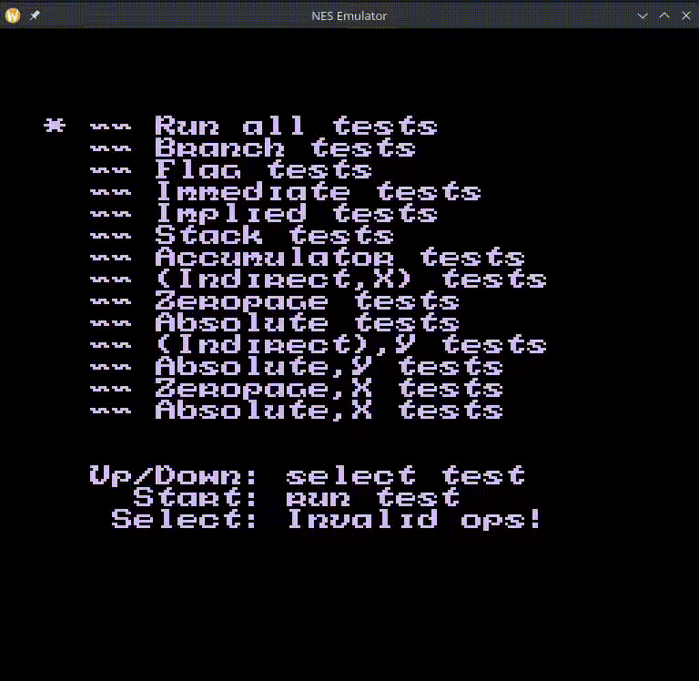

# NES Emulator

This is a simple attempt to create an emulator for the Nintendo Emulator System (NES) using the dotnet ecosystem, fueled by my passion for computers, love for speedrunning, and a curiosity to learn about the interaction of software and hardware. The code is heavily inspired by the tutorials of One Lone Coder (javidx9) and his [source code](https://github.com/OneLoneCoder/olcNES/) and hence will be using the same license. 

Besides this, the [nesdev.org](https://www.nesdev.org/) website and [PendleCodeMonkey's 6502 Emulator](https://github.com/PendleCodeMonkey/6502Emulator) has also been very helpful.

This is in no way a working emulator and should not be used to play the games, it is just an attempt to learn how the NES works.

Disclaimer

This is a hobby project created for educational purposes to better understand emulation, computer architecture, and low-level programming. It is not complete yet. However, it is in a playable state and can be used to play a few games without any audio.

It has passed the basic list of the "nestest" tests and some of the illegal opcodes tests

And it runs Super Mario Bros

Legal Notice:

This emulator is provided as-is for educational and personal use only. It does not include any copyrighted games, BIOS files, or proprietary Nintendo software.

Regarding ROMs:

This project does not endorse, encourage, or facilitate software piracy in any form. To use this emulator legally, you must:

    Only use ROM files that you have legally obtained

    Own the original physical cartridge of any game you play

    Create your own ROM dumps from cartridges you personally own

    Comply with all applicable copyright laws in your jurisdiction

Downloading ROM files from the internet is illegal in most countries, even if you own the physical cartridge. We do not provide, link to, or support any sources for downloading copyrighted ROMs.

Trademarks:

Nintendo, NES, Nintendo Entertainment System, and all associated game titles are trademarks and copyrights of Nintendo Co., Ltd. This project is not affiliated with, endorsed by, or sponsored by Nintendo in any way.

# License (OLC-3)
Copyright 2018, 2019, 2020, 2021 OneLoneCoder.com

Redistribution and use in source and binary forms, with or without 
modification, are permitted provided that the following conditions 
are met:

1. Redistributions or derivations of source code must retain the above 
   copyright notice, this list of conditions and the following disclaimer.

2. Redistributions or derivative works in binary form must reproduce 
   the above copyright notice. This list of conditions and the following 
   disclaimer must be reproduced in the documentation and/or other 
   materials provided with the distribution.

3. Neither the name of the copyright holder nor the names of its 
   contributors may be used to endorse or promote products derived 
   from this software without specific prior written permission.
    
THIS SOFTWARE IS PROVIDED BY THE COPYRIGHT HOLDERS AND CONTRIBUTORS 
"AS IS" AND ANY EXPRESS OR IMPLIED WARRANTIES, INCLUDING, BUT NOT 
LIMITED TO, THE IMPLIED WARRANTIES OF MERCHANTABILITY AND FITNESS FOR 
A PARTICULAR PURPOSE ARE DISCLAIMED. IN NO EVENT SHALL THE COPYRIGHT 
HOLDER OR CONTRIBUTORS BE LIABLE FOR ANY DIRECT, INDIRECT, INCIDENTAL, 
SPECIAL, EXEMPLARY, OR CONSEQUENTIAL DAMAGES (INCLUDING, BUT NOT 
LIMITED TO, PROCUREMENT OF SUBSTITUTE GOODS OR SERVICES; LOSS OF USE, 
DATA, OR PROFITS; OR BUSINESS INTERRUPTION) HOWEVER CAUSED AND ON ANY 
THEORY OF LIABILITY, WHETHER IN CONTRACT, STRICT LIABILITY, OR TORT 
(INCLUDING NEGLIGENCE OR OTHERWISE) ARISING IN ANY WAY OUT OF THE USE
OF THIS SOFTWARE, EVEN IF ADVISED OF THE POSSIBILITY OF SUCH DAMAGE.